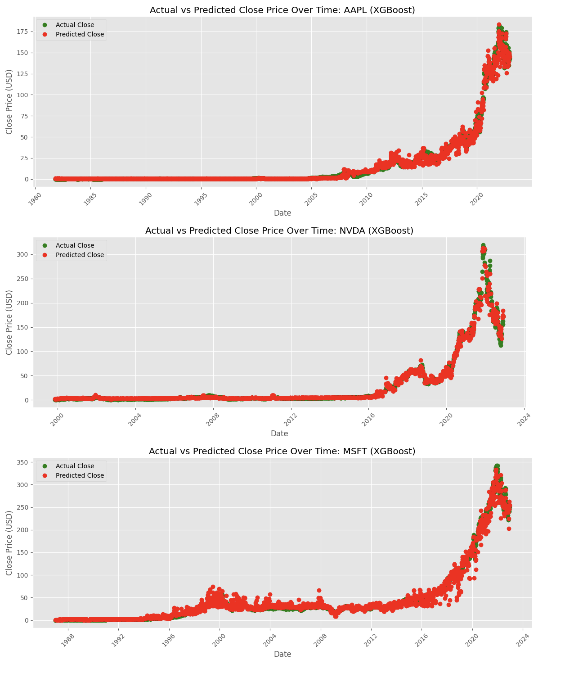
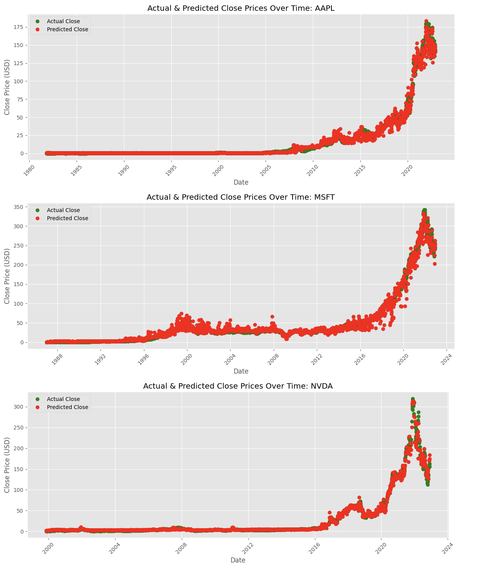
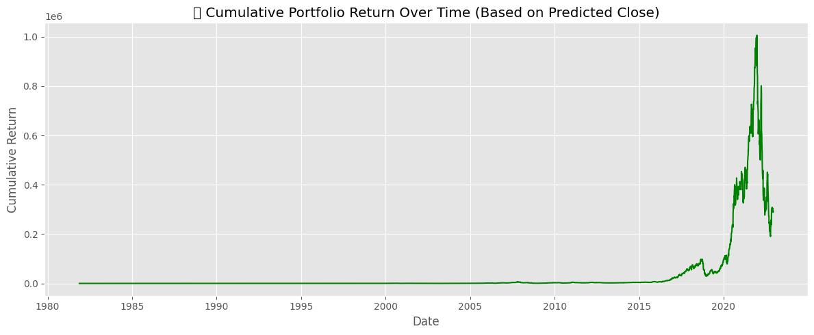

### Data-Driven Stock Price Prediction and Portfolio Optimization

> #### Introduction
1. The stock market is an important part of the global economy and serves as a major source for wealth generation and investment.
2. Predicting stock price movements has always been challenging due to the complexity, volatility, and non-linear behavior of fast moving financial markets.
3. <b>Two traditional approaches are:</b>
   1. Technical Analysis: Uses past price and volume data. Tools like Moving Averages, RSI, and MACD help identify trends and generate signals.
   2. Fundamental Analysis: Focuses on a company’s intrinsic value through financial reports, macro-economic indicators, and industry trends.
4. <b>However, both methods have limitations:</b>
   1. Technical analysis fails to detect complex relationships in data.
   2. Fundamental analysis is suited more for long-term investing, not short-term forecasting.

> #### Project Overview
The primary challenge addressed in this study is the difficulty of predicting stock closing prices due to the volatile and non-linear nature of financial markets, which traditional methods such as technical and fundamental analysis often fail to capture effectively. This research aims to train and evaluate various predictive models with appropriate hyperparameter tuning, using ML techniques to forecast daily stock closing prices. Beyond prediction, the study leverages the model outputs to construct an optimized investment portfolio that targets maximum returns while managing risk. The integration of stock price forecasting and portfolio optimization offers a comprehensive, data-driven approach to intelligent financial decision-making.

> #### Data Collection and Preprocessing
- Historical stock data for Apple (AAPL), Microsoft (MSFT), and Nvidia (NVDA) were imported from CSV files stored in Google Drive
- Duplicates and missing values were checked and handled. The 'Date' column was converted to pandas datetime format
- Individual stock DataFrames were combined into one unified dataset, with a 'Symbol' column to identify each stock.

> #### Data Source
- **Stock Market Data Apple (AAPL), Microsoft (MSFT), and Nvidia (NVDA)**-> Data comes from [**Kaggle**](https://www.kaggle.com/datasets/paultimothymooney/stock-market-data/)

> #### Model Training and Hyperparameter Tuning 1/2
#### XGBoost Regressor
* <b>XGBoost</b> is an efficient and scalable implementation of gradient boosting algorithms. It builds an ensemble of decision trees in sequence, where each tree attempts to correct the errors of the previous one. XGBoost supports regularization, missing value handling, and parallel computation, making it highly suitable for financial datasets.
* <b>Hyperparameter Tuning</b> is performed using GridSearchCV with 5-fold cross- validation on the training set:
   - n_estimators: [2, 5, 10, 20] — Number of trees.
   - learning_rate: [0.01, 0.1, 0.2] — How big each tree is.

#### XGBoost - Price Prediction Results

> #### Model Training and Hyperparameter Tuning 2/2
#### Random Forest Regressor
* <b>Random Forest</b> is an ensemble learning method that constructs a large number of decision trees during training time and outputs the average prediction. It is robust to overfitting and effective for tabular data.
* <b>Hyperparameter Tuning</b> is done through Grid search with cross-validation was used to find the best combination of:
  - n_estimators: [5, 10, 20, 50] — Number of trees in the forest. 
  - max_depth: [None, 5, 10, 20] — Maximum depth of each tree. 
  - min_samples_split: [2, 5, 10, 20] — Minimum samples to split a node

#### Random Forest - Price Prediction Results

> #### Evaluation Models Performance Comparison Metric Results

| Model             | MAE    | MSE     | RMSE   | R²     | MAPE   |
|-------------------|--------|---------|--------|--------|--------|
| Random Forest     | 0.6721 | 6.6828  | 2.5851 | 0.9978 | 0.0210 |
| XGBoost Regressor | 2.8529 | 35.7730 | 5.9811 | 0.9882 | 0.6945 |

- The Random Forest and XGBoost models results shows that Random Forest outperformed XGBoost in predicting daily stock closing prices across all evaluation metrics. 
- With a lower MAE (0.67) and RMSE (2.58), and a higher R² score (0.9978), the model demonstrated low errors between actual and predicted. Its MAPE of just 2.1% indicates excellent predictive reliability. 
- XGBoost, while still achieving a strong R² of 0.9882, produced higher error values, particularly in MAPE, suggesting less precision in certain scenarios. These results are visually supported by time-series plots showing that the Random Forest model closely tracks the actual price trends for AAPL, MSFT, and NVDA

> #### Portfolio Construction & Cumulative Return Analysis
Once stock prices are predicted using machine learning models, the next step is to evaluate how those predictions translate into real-world financial gains. This is done through portfolio construction and performance tracking over time.

> #### Role of the Cumulative Return Plot

- From the early years until around 2015, the portfolio remained relatively flat. This indicate limited volatility in stock prices or that the model’s predictions during that time had minimal impact on returns.
- Between 2015 and 2021, the portfolio experienced strong upward growth, especially from 2019 to 2021. This suggests the model successfully identified bullish trends and allocated capital to stocks that performed well, resulting in rapid portfolio appreciation.
- Post-2021, the portfolio value declined sharply, which corresponds to broader real-world market corrections rather than model error. During this time, even well-informed predictions would not avoid losses entirely, as the market itself was in decline. This highlights that while the model aids in optimization, it does not eliminate market risk.

> ### Conclusion
* Two regression models, XGB Regressor and RandomForest Regressor, have been trained 
and evaluated with these important metrics, e.g., MAE, MSE, RMSE, R2, and MAPE. The 
other aim of these tables is to compare the performances between the XGBoost and the 
Random Forest models. The Random Forest model performed better than XGBoost with 
respect to all performance measures, showing better prediction and less error variance.

* Altogether, the findings confirm Random Forest as a decent baseline model on this stock 
price prediction task, and XGBoost, although slightly inferior in this regard, can be a 
reasonable candidate with a more optimal fine-tuning process or hybrid model 
architectures.

> #### GitHub Repository & Google Collab Notebook Access
- **GitHub** [Repository Link](https://github.com/ArslanShakar/stock_price_prediction.git)
- **Stock Price Prediction** [NoteBook Link](https://colab.research.google.com/drive/1KsFm282lTlpbVdxrP2iknzTg9iXF4PPu#scrollTo=-l1s3yLb9Bt5)

> Best Regards,
> 
> Arslan Shakar
> 
> #### Thank you!
